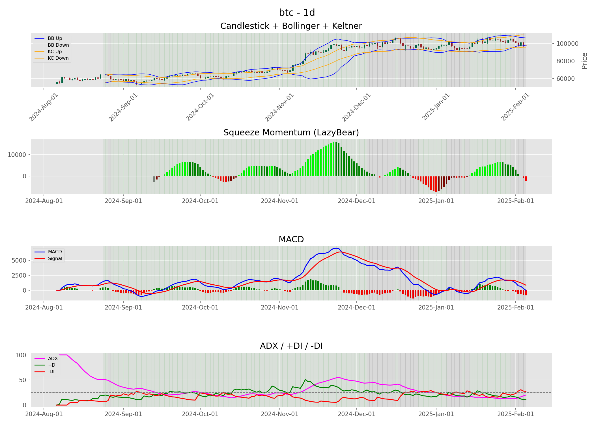

# 📊 Crypto Trading Analysis

Este projeto automatiza a coleta e análise de dados de criptomoedas utilizando APIs do CoinGecko e Binance, além de indicadores técnicos como MACD, ADX e Squeeze Momentum.

## 🚀 Funcionalidades
- **Coleta de Dados**: Obtém os 300 principais criptoativos e seus preços históricos.
- **Armazenamento**: Os dados são armazenados em um banco de dados SQLite.
- **Análise Técnica**: Implementação de indicadores como MACD, ADX e Squeeze Momentum.
- **Visualização**: Gráficos interativos de tendências de mercado.

## 📂 Estrutura do Projeto
```
crypto-trading-analysis/
│── README.md                   # Explicação completa do projeto
│── data/                        # Armazena os dados brutos e processados
│   ├── crypto_data.db           # Banco de dados SQLite
│   ├── all_data.csv             # Dados coletados
│── notebooks/                    # Notebooks Jupyter organizados
│   ├── 01_data_collection.ipynb  # Coleta e armazenamento de dados
│   ├── 02_data_analysis.ipynb    # Análise e indicadores técnicos
│── scripts/                      # Scripts Python para automação
│   ├── collect_crypto_data.py    # Script para coleta e armazenamento de dados
│   ├── analyze_crypto_signals.py # Script para análise e visualização
│── reports/                      # Relatórios e gráficos gerados
│   ├── best_trades.png           # Exemplo de gráfico gerado
│── requirements.txt              # Dependências do projeto
│── LICENSE                       # Licença de uso
```

## 💪 Como Usar
1. Clone o repositório:
   ```bash
   git clone https://github.com/seu-usuario/crypto-trading-analysis.git
   cd crypto-trading-analysis
   ```

2. Instale as dependências:
   ```bash
   pip install -r requirements.txt
   ```

3. Execute a coleta de dados:
   ```bash
   python scripts/collect_crypto_data.py
   ```

4. Execute a análise:
   ```bash
   python scripts/analyze_crypto_signals.py
   ```

## 📊 Exemplos de Gráficos

Aqui estão alguns exemplos dos gráficos gerados pelo projeto:



## 📈 Tecnologias Utilizadas
- **Python**
- **Pandas** para manipulação de dados
- **SQLite** para armazenamento
- **CCXT** para conexão com exchanges
- **Matplotlib / mplfinance** para visualização de dados
- **Logging** para monitoramento do sistema

## 👨‍💻 Autor
[Seu Nome](https://www.linkedin.com/in/felipe-rainel)

## ✨ Licença
Este projeto está sob a licença MIT - veja o arquivo [LICENSE](LICENSE) para mais detalhes.